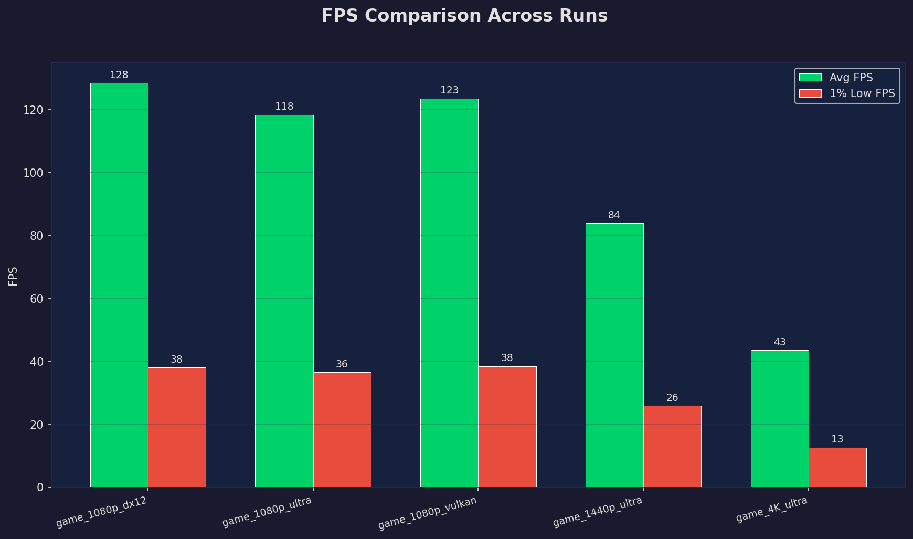
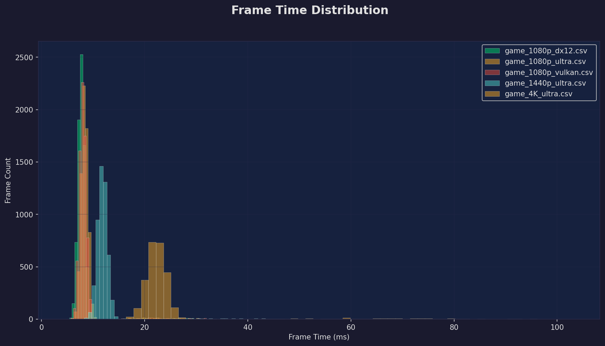
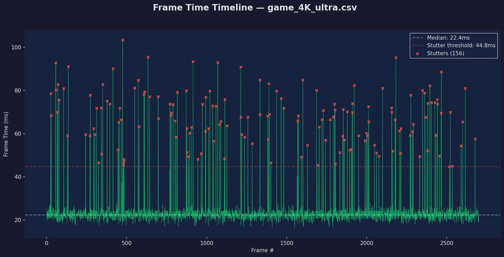
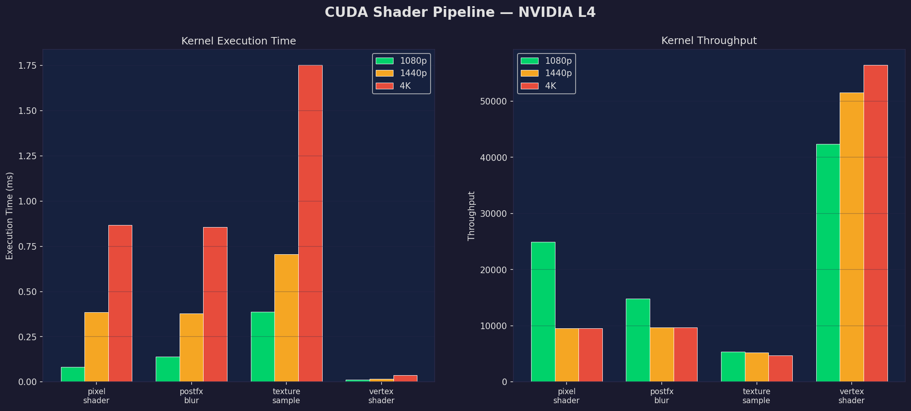
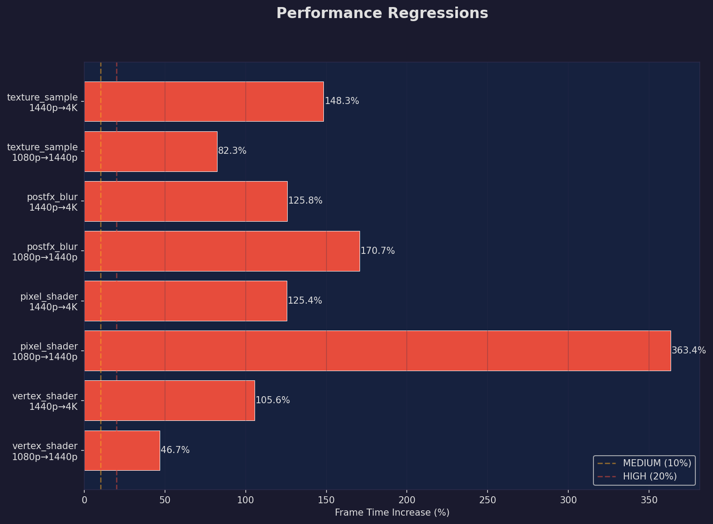
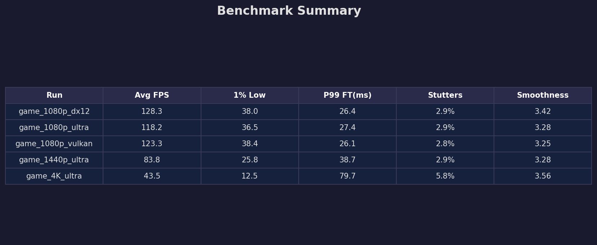

# 🎮 FrameForge

**GPU Performance Analysis Pipeline with AI-Powered Insights**

A full-stack GPU benchmarking and analysis platform combining C++ CUDA shader profiling, NVIDIA FrameView log analysis, PyTorch inference benchmarking, and an AI performance advisor built on NVIDIA NIM + LangChain.

---

## 📊 Performance Dashboards

### FPS Comparison Across Resolutions & APIs


### Frame Time Distribution — Consistency Analysis


### Stutter Detection Timeline — Per-Frame Analysis


### CUDA Shader Pipeline Throughput


### Automated Regression Detection Report


### Benchmark Summary Table


---

## 🏗 Architecture

```
FrameForge/
│
├── src/
│   ├── cuda_bench.cu              → C++ CUDA shader benchmarks with NVTX annotations
│   ├── Makefile                   → nvcc compilation & Nsight Systems profiling
│   ├── pytorch_bench.py           → PyTorch GPU inference (FP32 / FP16 / torch.compile)
│   ├── frameview_parser.py        → NVIDIA FrameView & PresentMon CSV analyzer
│   ├── regression_detector.py     → Performance regression detection engine
│   ├── ai_advisor.py              → AI advisor powered by NVIDIA NIM + LangChain
│   ├── dashboard.py               → Matplotlib performance chart generator
│   └── main.py                    → CLI pipeline orchestrator
│
├── frameview_logs/                → FrameView CSV data (DX11, DX12, Vulkan)
├── nsight_profiles/               → Nsight Systems .nsys-rep profiles
├── results/                       → Benchmark results, charts, AI reports
├── requirements.txt
└── README.md
```

---

## 🔥 What It Does

### 1. C++ CUDA Shader Benchmarks
Real CUDA kernels compiled with `nvcc` simulating the GPU gaming pipeline, annotated with **NVTX markers** for NVIDIA Nsight Systems profiling:

| Kernel | What It Simulates | What It Measures |
|--------|-------------------|-----------------|
| `vertex_shader` | MVP matrix transform per vertex | MVerts/s |
| `pixel_shader` | Blinn-Phong per-pixel lighting | MPixels/s |
| `postfx_blur` | 5×5 Gaussian post-processing | MPixels/s |
| `texture_sample` | Bilinear texture interpolation | MSamples/s |

Benchmarked across **1080p → 1440p → 4K** with CUDA Event timing. Profiled with `nsys profile --trace=cuda,nvtx`.

### 2. FrameView / PresentMon Log Analysis
Parses NVIDIA FrameView CSV logs and computes the exact metrics GPU reviewers use:

- FPS Percentiles (Avg, P1, P5, P95, P99)
- Frame Time Statistics (Mean, Median, P99, Stdev)
- Stutter Detection (frames > 2× median)
- Smoothness Score (P99/Median ratio)
- Supports **DirectX 9/11/12, Vulkan, and OpenGL** captures

### 3. PyTorch Inference Benchmarking
GPU inference profiling across three optimization modes:

| Mode | What It Tests |
|------|--------------|
| **FP32** | Baseline inference (32-bit float) |
| **FP16 Mixed Precision** | Half-precision with `torch.autocast` |
| **torch.compile()** | PyTorch 2.0 graph compilation optimization |

Models tested: ResNet-50, Transformer-Encoder-6L, ConvNet-4L — measuring latency, throughput, GPU memory, and speedup ratios.

### 4. Automated Regression Detection
Compares benchmark runs and flags performance drops:

- **MEDIUM** → >10% frame time increase
- **HIGH** → >20% frame time increase

Detects regressions across resolutions, quality settings, driver versions, and API changes.

### 5. AI Performance Advisor
An AI agent built with **NVIDIA NIM** (Llama 3.1) and **LangChain** that:

- Reads CUDA benchmark + FrameView analysis data
- Identifies whether kernels are compute-bound or memory-bound
- Analyzes resolution scaling efficiency
- Generates optimization recommendations
- Provides root cause analysis for detected regressions

---

## 🚀 Quick Start

### Prerequisites
- NVIDIA GPU with CUDA support
- CUDA Toolkit (`nvcc`, NVTX)
- Python 3.8+
- (Optional) NVIDIA NIM API key from [build.nvidia.com](https://build.nvidia.com)

### Install & Run
```bash
git clone https://github.com/YOUR_USERNAME/FrameForge.git
cd FrameForge
pip install -r requirements.txt

# Compile C++ CUDA benchmark
cd src && make

# Run full pipeline
python main.py --full
```

### Compile & Profile CUDA Benchmark
```bash
cd src
nvcc -O2 -lnvToolsExt -o cuda_bench cuda_bench.cu
./cuda_bench                                              # Run benchmarks
nsys profile --trace=cuda,nvtx -o cuda_profile ./cuda_bench   # Profile with Nsight
```

### Analyze FrameView Logs
```bash
# Drop FrameView CSVs into frameview_logs/ then:
python main.py --analyze
```

### Run AI Advisor
```bash
export NVIDIA_API_KEY=nvapi-XXXXX
python main.py --full
```

---

## 🛠 Tech Stack

| Category | Technologies |
|----------|-------------|
| **Languages** | C/C++, CUDA, Python |
| **NVIDIA Tools** | NVTX, Nsight Systems, FrameView, NIM API |
| **AI / ML** | NVIDIA NIM (Llama 3.1), LangChain, PyTorch |
| **Optimization** | FP16 Mixed Precision, torch.compile(), CUDA Events |
| **Data & Viz** | Pandas, NumPy, Matplotlib |
| **Platforms** | Linux, Google Colab (NVIDIA L4/A100/T4) |

---

## 📁 Output Files

| File | Description |
|------|-------------|
| `cuda_results.json` | CUDA shader benchmark timing + throughput |
| `pytorch_results.json` | PyTorch FP32/FP16/compile inference results |
| `frameview_stats.json` | FrameView analysis (FPS percentiles, stutters) |
| `nsight_stats.txt` | Nsight Systems profiling statistics |
| `ai_advisor_report.txt` | AI-generated performance recommendations |
| `fps_comparison.png` | FPS bar chart across runs |
| `frame_time_distribution.png` | Frame time histogram |
| `stutter_timeline.png` | Per-frame stutter detection |
| `cuda_throughput.png` | CUDA kernel throughput comparison |
| `regression_report.png` | Regression severity visualization |
| `summary_table.png` | Benchmark summary table |

---


## 📝 Notes

- FrameView CSV parser supports real NVIDIA FrameView and PresentMon log imports. Demonstration uses synthetic frame time data matching FrameView's CSV schema across DirectX 11, DirectX 12, and Vulkan runtimes.
- CUDA benchmarks compiled and profiled on NVIDIA GPU via Google Colab.
- NVTX annotations are present in `cuda_bench.cu` for local Nsight Systems GUI timeline visualization.

---

## 👤 Author

Akshay Keerthi AS | Northeastern University, MS Computer Science