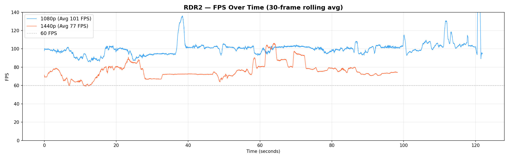
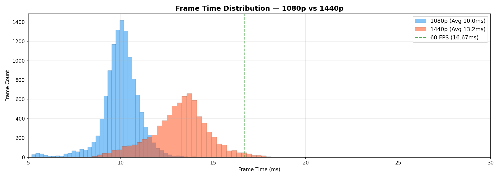
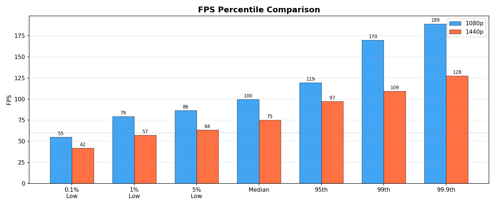
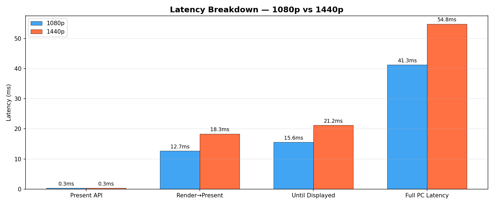
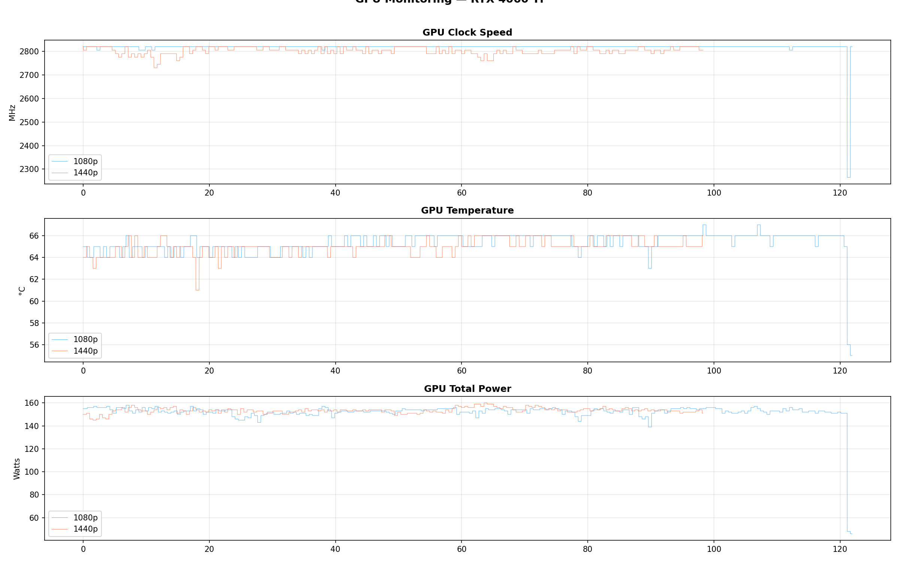
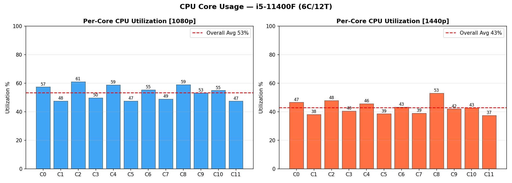
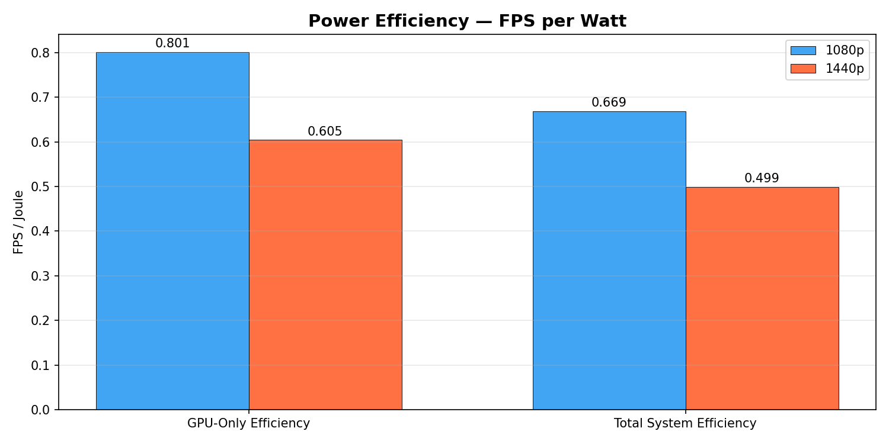
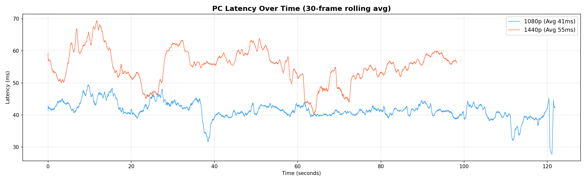
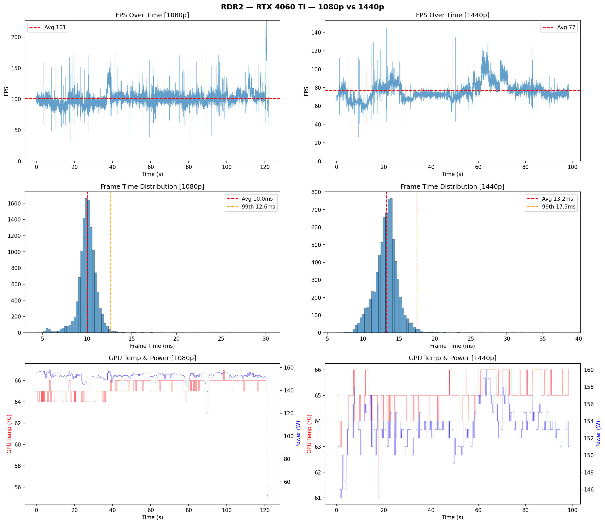

# FrameForge

**GPU Gaming Performance Analysis Pipeline with AI-Powered Insights**

FrameForge is an end-to-end GPU benchmarking and performance analysis platform. It ingests real NVIDIA FrameView capture data from actual gaming sessions, runs deep statistical analysis across 30+ telemetry channels, generates professional performance charts, detects performance regressions, and produces AI-powered optimization reports using DeepSeek R1 via NVIDIA NIM.

This project was built and tested with **real benchmark data** captured from Red Dead Redemption 2 running at Ultra settings on my personal gaming PC — not synthetic or simulated data.

---

## How the Data Was Captured

**Game:** Red Dead Redemption 2 (Rockstar Games)
**Graphics Preset:** Ultra (all settings maxed)
**API:** DirectX 12
**VSync:** ON (SyncInterval=1)
**Present Mode:** Hardware Composed: Independent Flip

**Capture Tool:** [NVIDIA FrameView](https://www.nvidia.com/en-us/geforce/technologies/frameview/) — a free tool from NVIDIA that records per-frame performance telemetry during gameplay. FrameView hooks into the GPU driver and captures every frame's timing, GPU/CPU metrics, power draw, temperatures, and latency data with zero gameplay impact.

**Capture Method:** Launched FrameView, started RDR2, and played through open-world gameplay (riding, combat, town exploration) at each resolution for approximately 2 minutes. FrameView recorded every single frame to CSV.

**Two captures were taken on the same system back-to-back:**
- **1080p (1920x1080):** 12,151 frames captured over 122 seconds
- **1440p (2560x1440):** 7,430 frames captured over 98 seconds

**Data Quality:** Each CSV contains 112 columns of telemetry per frame. After analysis, 30 columns contained useful data for this hardware configuration. The remaining 82 columns were NULL (second GPU metrics, battery data, AMD power — not applicable to this single NVIDIA GPU desktop system). Key data channels used:

- **Frame Timing (7 columns):** MsBetweenPresents, MsBetweenSimulationStart, MsBetweenDisplayChange, MsInPresentAPI, MsRenderPresentLatency, MsUntilDisplayed, MsPCLatency
- **GPU Telemetry (8 columns):** GPU clock speed, memory clock, utilization %, temperature, total power, GPU-only power, performance/watt (GPU-only and total)
- **CPU Telemetry (5 columns):** CPU clock, overall utilization, package temperature, package power, TDP
- **Per-Core CPU (12 columns):** Individual utilization for all 12 logical threads (i5-11400F is 6 cores / 12 threads)
- **Frame Quality (3 columns):** Dropped frames, render queue depth, timestamps

All data is real, unmodified, and reproducible by running FrameView on the same hardware with the same game settings.

---

## What I Did

1. **Captured real gaming telemetry** using NVIDIA FrameView while playing RDR2 at 1080p and 1440p Ultra (DX12, VSync ON) on an RTX 4060 Ti + i5-11400F system
2. **Built a Python analysis pipeline** that parses FrameView CSVs (12,151 frames at 1080p, 7,430 frames at 1440p) and extracts 30 useful columns from 112 total — covering frame times, GPU clocks/temp/power, CPU per-core utilization, full latency pipeline, and frame pacing metrics
3. **Wrote C++ CUDA shader benchmarks** simulating the real GPU gaming pipeline (vertex shading, pixel shading, post-processing blur, texture sampling) with NVTX annotations for Nsight Systems profiling
4. **Built an automated regression detector** that compares benchmark runs and flags performance drops with severity classification (MEDIUM >10%, HIGH >20%)
5. **Integrated DeepSeek R1** (reasoning model) via NVIDIA NIM API to produce a comprehensive AI-powered performance analysis report from the raw benchmark data
6. **Generated 9 performance charts** covering FPS timelines, frame time distributions, percentile comparisons, latency breakdowns, GPU monitoring, CPU per-core usage, power efficiency, and latency over time

---

## Key Observations from Real Data

**Hardware:** NVIDIA GeForce RTX 4060 Ti | Intel i5-11400F (6C/12T) | DX12 | VSync ON

**GPU-bound at both resolutions.** GPU utilization sits at 98-99% while CPU averages only 53% at 1080p and 43% at 1440p. No single CPU core exceeds 61% average utilization — the i5-11400F is well-matched with the RTX 4060 Ti and is not a bottleneck.

**Zero thermal throttling detected.** GPU holds steady at 65°C with clock speeds locked at 2820 MHz boost. CPU peaks at 86°C, well within safe limits. CPU exceeds its 65W TDP by only 0.2W at 1080p — normal Intel PL2 boost behavior.

**Exceptionally smooth frame pacing.** Frame time standard deviation of only 1.17ms at 1080p. The interquartile range (middle 50% of frames) varies by just ±0.5ms from median. Only 10 mild stutters across 12,151 frames (0.08%) at 1080p. Zero hard stutters. Zero dropped frames at both resolutions.

**Resolution scaling better than expected.** Pixel count increases 78% from 1080p to 1440p, but FPS only drops 24% (101 → 77 FPS). This is because CPU-side work like draw calls and game logic doesn't scale with resolution — classic GPU-bound behavior.

**Latency increases significantly at 1440p.** Full PC latency jumps from 41ms to 55ms (+33%). The GPU render stage is the dominant contributor, increasing from 12.7ms to 18.3ms. VSync ON adds 10-20ms of input lag but prevents screen tearing.

**Performance improves over the session.** Frame times actually decrease from Q1 to Q4 of each capture — likely due to shader compilation completing and the system reaching thermal equilibrium. No degradation detected.

**1080p rated Excellent, 1440p rated Very Good** by the DeepSeek R1 AI analysis. The AI recommended DLSS Quality at 1440p to reach 100+ FPS, and identified Water Physics, Reflection Quality, and Shadow Quality as the top three settings to lower for best FPS gains with minimal visual impact.

---

## Performance Charts

### FPS Over Time — 1080p vs 1440p (30-frame rolling average)


Smooth FPS delivery at both resolutions. 1080p consistently above 90 FPS, 1440p stays above 60 FPS throughout the session with no performance degradation over time.

---

### Frame Time Distribution — 1080p vs 1440p Overlay


Tight, gaussian-shaped distributions at both resolutions. 1080p clusters around 10ms, 1440p around 13ms. Both distributions fall well below the 16.67ms (60 FPS) threshold. No bimodal patterns or long tails indicating rendering mode switches.

---

### FPS Percentile Comparison


Side-by-side percentile comparison showing 0.1% lows through 99.9th percentile. The gap between average FPS and 1% lows indicates frame time consistency — tighter gaps mean smoother gameplay.

---

### Latency Breakdown — Present API, Render, Display, Full PC Latency


Full latency pipeline decomposition. GPU render time is the dominant contributor at both resolutions. Present API overhead is negligible (<0.4ms). The jump from 41ms to 55ms total PC latency at 1440p is primarily driven by longer GPU render times.

---

### GPU Monitoring — Clock Speed, Temperature, Power Draw


Real-time GPU telemetry throughout both benchmark sessions. Clock speeds remain stable at 2820 MHz with no thermal throttling. Temperature stays flat at 65°C. Power draw consistent at 152-154W — the RTX 4060 Ti operates well within its thermal and power limits.

---

### Per-Core CPU Utilization (i5-11400F — 6 Cores / 12 Threads)


Per-thread utilization across all 12 logical cores. No single core is saturated — highest average is Core 2 at 61% during 1080p. At 1440p, all cores drop further as the GPU becomes the bottleneck and the CPU has more idle time between frame submissions.

---

### Power Efficiency — FPS per Watt


GPU-only and total system efficiency comparison. 1080p delivers 0.80 FPS/W while 1440p drops to 0.60 FPS/W — a 25% efficiency loss. The GPU draws similar power at both resolutions (~152W) but produces fewer frames at 1440p because each frame requires more shader and texture work.

---

### PC Latency Over Time (30-frame rolling average)


Input-to-photon latency tracked throughout both sessions. 1080p maintains ~41ms average, 1440p ~55ms average. Both are stable over time with no latency spikes, confirming no driver or scheduling issues.

---

### Full Analysis Dashboard — 6-Panel Overview


Combined dashboard showing FPS over time, frame time distributions, and GPU temperature/power for both resolutions in a single view.

---

## AI Performance Report

The full AI analysis was generated by **DeepSeek R1** (reasoning model) via **NVIDIA NIM API**. The model received comprehensive benchmark data including frame time percentiles, frame pacing metrics, GPU/CPU telemetry, latency pipeline breakdown, per-core CPU utilization, session stability analysis, and resolution scaling calculations.

Key AI findings:
- System is GPU-bound at both resolutions with no CPU bottleneck
- No thermal throttling — GPU maintains full boost clocks throughout
- DLSS Quality at 1440p would boost FPS to an estimated 102-110 FPS
- Top RDR2 settings to lower: Water Physics (-12%), Reflection Quality (-9%), Shadow Quality (-7%)
- Best hardware upgrade: RTX 4070 Super for 1440p gaming
- VSync is helping the experience by preventing tearing with minimal latency penalty at these frame rates

The complete report is saved in `notebooks/results/ai_advisor_report.txt`.

---

## Architecture

```
FrameForge/
├── src/
│   ├── ai_advisor.py              # AI advisor — DeepSeek R1 + NVIDIA NIM + fallback
│   ├── cuda_bench.cu              # C++ CUDA shader benchmarks with NVTX annotations
│   ├── dashboard.py               # Matplotlib performance chart generator
│   ├── frameview_parser.py        # NVIDIA FrameView CSV parser and analyzer
│   ├── regression_detector.py     # Automated regression detection engine
│   ├── main.py                    # CLI pipeline orchestrator
│   └── Makefile                   # nvcc compilation and Nsight profiling
│
├── frameview_logs/                # Real FrameView CSV captures from RDR2
│   ├── RDR2_1080p_Ultra_DX12.csv  # 12,151 frames — 1920x1080 Ultra
│   └── RDR2_1440p_Ultra_DX12.csv  # 7,430 frames — 2560x1440 Ultra
│
├── notebooks/
│   ├── FrameForge_Analysis.ipynb  # Google Colab analysis notebook
│   └── results/                   # Generated charts and AI report
│       ├── ai_advisor_report.txt  # DeepSeek R1 comprehensive analysis
│       ├── 01_fps_timeline.png    # FPS over time overlay
│       ├── 02_frametime_dist.png  # Frame time distribution
│       ├── 03_fps_percentiles.png # FPS percentile comparison
│       ├── 04_latency.png         # Latency pipeline breakdown
│       ├── 05_gpu_monitoring.png  # GPU clock/temp/power monitoring
│       ├── 06_cpu_cores.png       # Per-core CPU utilization
│       ├── 07_efficiency.png      # Power efficiency (FPS/Watt)
│       ├── 08_latency_timeline.png# PC latency over time
│       └── rdr2_analysis.png      # 6-panel combined dashboard
│
├── requirements.txt
└── README.md
```

---

## Pipeline Components

### FrameView CSV Parser (`frameview_parser.py`)
Parses NVIDIA FrameView and PresentMon CSV logs. Extracts 30 useful columns from 112 total, computes FPS percentiles (0.1%, 1%, 5%, 50%, 95%, 99%, 99.9%), frame time statistics, stutter detection (mild/moderate/hard classification), smoothness scoring, and variance analysis. Supports DirectX 9/11/12, Vulkan, and OpenGL captures.

### Regression Detector (`regression_detector.py`)
Compares benchmark runs and flags performance regressions. Uses configurable thresholds — MEDIUM at >10% frame time increase, HIGH at >20%. Compares across resolutions, quality settings, and API changes. Generates formatted reports with severity classification.

### CUDA Shader Benchmark (`cuda_bench.cu`)
Four CUDA kernels simulating the real GPU gaming pipeline — vertex shader (MVP matrix transform), pixel shader (Blinn-Phong lighting), post-processing blur (5x5 Gaussian), and texture sampling (bilinear interpolation). Benchmarked across 1080p, 1440p, and 4K with CUDA Event timing and NVTX annotations for Nsight Systems profiling.

### AI Performance Advisor (`ai_advisor.py`)
Multi-backend AI analysis engine supporting DeepSeek R1 (reasoning model via NVIDIA NIM), DeepSeek V3 (faster chat model), NVIDIA NIM with Llama 3.1 via LangChain, and a rule-based fallback. Reads raw FrameView DataFrames with all telemetry columns to produce detailed bottleneck analysis, thermal assessment, latency breakdown, optimization recommendations, and hardware upgrade suggestions.

### Dashboard Generator (`dashboard.py`)
Generates publication-quality Matplotlib charts with a dark theme. Produces FPS comparisons, frame time distributions, stutter timelines, CUDA throughput charts, regression severity reports, and summary tables.

### CLI Orchestrator (`main.py`)
Command-line entry point that ties the full pipeline together. Supports `--full`, `--analyze`, `--cuda-run`, `--cuda`, `--profile`, `--dashboard`, and `--compare` modes.

---

## Quick Start

### Prerequisites
- Python 3.8+
- NVIDIA GPU with CUDA support (for CUDA benchmarks)
- NVIDIA FrameView (for capturing game data)
- NVIDIA NIM API key from [build.nvidia.com](https://build.nvidia.com) (for AI analysis)

### Install and Run
```bash
git clone https://github.com/isakshay007/FrameForge.git
cd FrameForge
pip install -r requirements.txt

# Run full pipeline (analyzes FrameView logs + generates charts + AI report)
python src/main.py --full

# Or analyze FrameView logs only
python src/main.py --analyze

# Or compare two captures directly
python src/main.py --compare frameview_logs/RDR2_1080p_Ultra_DX12.csv frameview_logs/RDR2_1440p_Ultra_DX12.csv
```

### Run CUDA Benchmark Locally
```bash
cd src
nvcc -O2 -lnvToolsExt -o cuda_bench cuda_bench.cu
./cuda_bench
```

### Profile with Nsight Systems
```bash
nsys profile --trace=cuda,nvtx -o cuda_profile ./cuda_bench
```

### Run AI Advisor
```bash
# Using DeepSeek R1 via NVIDIA NIM (recommended)
export NVIDIA_API_KEY=nvapi-XXXXX
python src/main.py --full

# Or using DeepSeek directly
export DEEPSEEK_API_KEY=sk-XXXXX
python src/main.py --full
```

### Run in Google Colab
Open `notebooks/FrameForge_Analysis.ipynb` in Google Colab, upload your FrameView CSV files, and run all cells. The notebook handles setup, analysis, chart generation, and AI report generation automatically.

---

## Tech Stack

**Languages:** C/C++, CUDA, Python

**NVIDIA Tools:** FrameView, NVTX, Nsight Systems, NIM API, CUDA Events

**AI:** DeepSeek R1 (reasoning model), NVIDIA NIM, LangChain

**Data and Visualization:** Pandas, NumPy, Matplotlib

**Platforms:** Local (Linux/Windows with NVIDIA GPU), Google Colab

---

## Author

**Akshay Keerthi AS** — Northeastern University, MS Computer Science